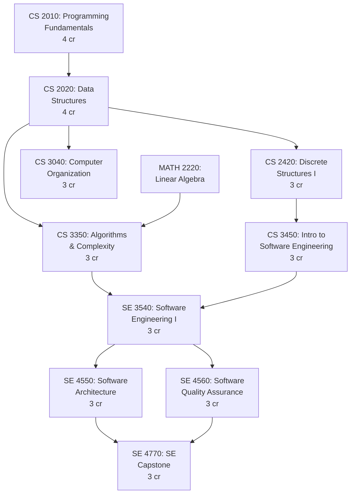
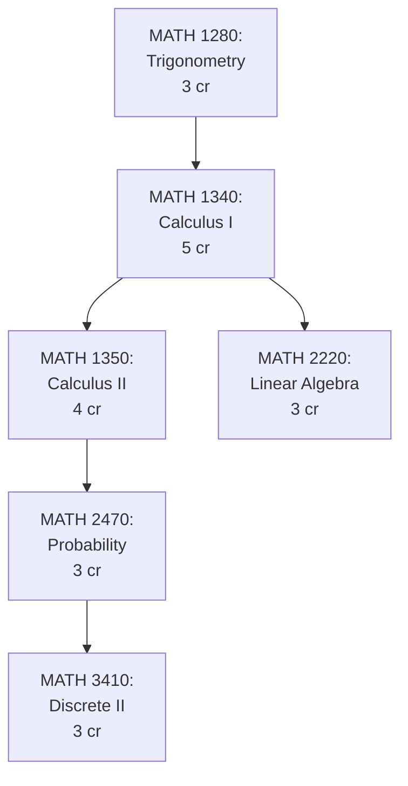
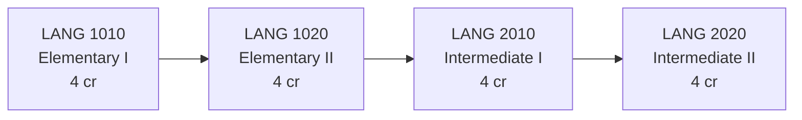

# BGSU Software Engineering B.S. Curriculum Guide

## Overview

The **Bachelor of Science in Software Engineering (BSSE)** at Bowling Green State University is a comprehensive 120-credit degree program designed to prepare students for careers in professional software development, systems engineering, and technology leadership.

**Last Updated:** January 2026  
**Data Source:** CourseSeeder.java and CourseInfoSeeder.java  
**Total Courses in Catalog:** 215 courses across 7 requirement categories

---

## Degree Requirements Summary

| Category | Credits Required | Course Count | Notes |
|----------|-----------------|--------------|-------|
| **SE Core Requirements** | 43 credits | 15 courses | Required for all BSSE students |
| **SE Core Electives** | 9 credits | Choose 3 of 10 | Specialized tracks available |
| **Mathematics** | 18 credits | 6 required courses | Includes Calculus I & II, Linear Algebra |
| **Science with Lab** | 10 credits | 2 lab sequences | Chemistry, Physics, Biology, or Geology |
| **World Languages** | 16 credits | 4-course sequence | 10 languages available |
| **Writing** | 7 credits | 3 writing courses | WRIT 1010/1110 + WRIT 2010 |
| **MDC (Multidisciplinary)** | 12 credits | 4 courses | 16 subject areas, ~100 courses |
| **BGP (General Education)** | Varies | ~30 courses | Breadth requirements |
| **Total** | **120 credits minimum** | | Includes electives for balance |

---

## Software Engineering Core Requirements (43 credits)

### Prerequisite Flow Diagram



### Required Courses (15 courses, 43 credits)

| Course | Title | Credits | Prerequisites | Typical Semester |
|--------|-------|---------|--------------|------------------|
| **CS 2010** | Programming Fundamentals | 4 | None | Year 1 Fall |
| **CS 2900** | CS Freshman Seminar | 1 | None | Year 1 Fall |
| **CS 2020** | Data Structures | 4 | CS 2010 | Year 1 Spring |
| **CS 2420** | Discrete Structures I | 3 | CS 2020 | Year 2 Fall |
| **CS 3040** | Computer Organization | 3 | CS 2020 | Year 2 Spring |
| **CS 3350** | Algorithms and Complexity | 3 | CS 2020, MATH 2220 | Year 2 Fall |
| **CS 3450** | Intro to Software Engineering | 3 | CS 2420 | Year 2 Spring |
| **SE 3540** | Software Engineering I | 3 | CS 3350, CS 3450 | Year 3 Fall |
| **SE 4510** | Software Project Management | 3 | SE 3540 | Year 3 Spring |
| **SE 4550** | Software Architecture | 3 | SE 3540 | Year 4 Fall |
| **SE 4560** | Software Quality Assurance | 3 | SE 3540 | Year 4 Fall |
| **SE 4770** | Software Engineering Capstone | 3 | SE 4550, SE 4560 | Year 4 Spring |
| **CS 4210** | Operating Systems I | 3 | CS 3040 | Year 3 Fall |
| **CS 4250** | Computer Networks | 3 | CS 3040 | Year 3 Spring |
| **CS 4900** | Professional Practice Seminar | 1 | Senior standing | Year 4 Spring |

### Core Requirements Implementation Notes

- **CS 2010** is the gateway course - must be completed before progressing
- **MATH 2220** (Linear Algebra) is a hard prerequisite for **CS 3350**
- **SE 4770** (Capstone) requires **both** SE 4550 and SE 4560 completion
- **CS 2900** and **CS 4900** are 1-credit seminars for professional development
- Typical progression takes 4 years with balanced 15-17 credit semesters

---

## SE Core Electives (Choose 3 of 10, 9 credits)

Students must select **3 courses (9 credits)** from the following elective options to specialize their degree:

| Course | Title | Credits | Prerequisites | Focus Area |
|--------|-------|---------|--------------|------------|
| **CS 3060** | Web Application Development | 3 | CS 2020 | Full-Stack Development |
| **CS 3140** | Database Systems | 3 | CS 2020 | Data Management |
| **CS 3240** | Human-Computer Interaction | 3 | CS 2020 | UX/UI Design |
| **CS 4110** | Mobile Application Development | 3 | CS 3060 or CS 3140 | Mobile Development |
| **CS 4140** | Advanced Database Systems | 3 | CS 3140 | Data Engineering |
| **CS 4240** | Advanced HCI & UX Design | 3 | CS 3240 | User Experience |
| **CS 4310** | Cybersecurity Fundamentals | 3 | CS 3040, CS 4210 | Security |
| **CS 4340** | Machine Learning | 3 | CS 3350, MATH 2220 | AI/ML |
| **CS 4440** | Cloud Computing | 3 | CS 4210, CS 4250 | Cloud Architecture |
| **CS 4540** | DevOps and CI/CD | 3 | SE 3540 | Automation |

### Recommended Elective Tracks

**Track 1: Full-Stack Web Developer**
- CS 3060 (Web Development)
- CS 3140 (Databases)
- CS 4110 (Mobile Development)

**Track 2: Data Engineer**
- CS 3140 (Databases)
- CS 4140 (Advanced Databases)
- CS 4340 (Machine Learning)

**Track 3: Security Engineer**
- CS 4310 (Cybersecurity)
- CS 4440 (Cloud Computing)
- CS 4540 (DevOps)

**Track 4: UX/Product Engineer**
- CS 3060 (Web Development)
- CS 3240 (Human-Computer Interaction)
- CS 4240 (Advanced HCI)

---

## Mathematics Requirements (18 credits)

### Prerequisite Flow



### Required Courses (6 courses, 18 credits)

| Course | Title | Credits | Prerequisites | Typical Semester |
|--------|-------|---------|--------------|------------------|
| **MATH 1280** | Trigonometry and Analytic Geometry | 3 | Placement | Year 1 Fall |
| **MATH 1340** | Calculus I | 5 | MATH 1280 | Year 1 Spring |
| **MATH 1350** | Calculus II | 4 | MATH 1340 | Year 2 Fall |
| **MATH 2220** | Linear Algebra | 3 | MATH 1340 | Year 2 Spring |
| **MATH 2470** | Probability and Statistics | 3 | MATH 1350 | Year 2 Spring |
| **MATH 3410** | Discrete Structures II | 3 | MATH 2470, CS 2420 | Year 3 Fall |

### Math Electives (Optional)

For students interested in AI/ML or data science, consider:
- **MATH 3310** - Differential Equations (3 cr)
- **MATH 3410** - Numerical Analysis (3 cr)
- **MATH 4420** - Advanced Linear Algebra (3 cr)

---

## Science Requirements (10 credits)

Students must complete **TWO lab sequences** (5 + 5 credits) from the following options:

### Option 1: Chemistry Sequence

| Course | Title | Credits | Prerequisites |
|--------|-------|---------|--------------|
| **CHEM 1230** | General Chemistry I | 5 | None |
| **CHEM 1240** | General Chemistry II | 5 | CHEM 1230 |

### Option 2: Physics Sequence

| Course | Title | Credits | Prerequisites |
|--------|-------|---------|--------------|
| **PHYS 2010** | Physics I: Mechanics | 5 | MATH 1340 |
| **PHYS 2020** | Physics II: Electricity & Magnetism | 5 | PHYS 2010, MATH 1350 |

### Option 3: Biology Sequence

| Course | Title | Credits | Prerequisites |
|--------|-------|---------|--------------|
| **BIOL 2040** | Biological Sciences I | 5 | None |
| **BIOL 2050** | Biological Sciences II | 5 | BIOL 2040 |

### Option 4: Geology Sequence

| Course | Title | Credits | Prerequisites |
|--------|-------|---------|--------------|
| **GEOL 1040** | Physical Geology | 5 | None |
| **GEOL 1050** | Historical Geology | 5 | GEOL 1040 |

### Option 5: Environmental Science Sequence

| Course | Title | Credits | Prerequisites |
|--------|-------|---------|--------------|
| **ENVS 1010** | Environmental Science I | 5 | None |
| **ENVS 1020** | Environmental Science II | 5 | ENVS 1010 |

**Recommendation:** Physics is most relevant to computer science (computational modeling, simulations), but choose based on interest.

---

## World Language Requirements (16 credits)

Complete **4 courses (4 + 4 + 4 + 4 credits)** in a single language through the 2020 level.

### Available Languages (10 families)

| Language | Course Sequence | Total Credits |
|----------|----------------|---------------|
| **Spanish** | SPAN 1010 → 1020 → 2010 → 2020 | 16 credits |
| **French** | FREN 1010 → 1020 → 2010 → 2020 | 16 credits |
| **German** | GERM 1010 → 1020 → 2010 → 2020 | 16 credits |
| **Chinese** | CHIN 1010 → 1020 → 2010 → 2020 | 16 credits |
| **Japanese** | JAPN 1010 → 1020 → 2010 → 2020 | 16 credits |
| **Arabic** | ARAB 1010 → 1020 → 2010 → 2020 | 16 credits |
| **Russian** | RUSN 1010 → 1020 → 2010 → 2020 | 16 credits |
| **Italian** | ITAL 1010 → 1020 → 2010 → 2020 | 16 credits |
| **Korean** | KORE 1010 → 1020 → 2010 → 2020 | 16 credits |
| **Latin** | LATN 1010 → 1020 → 2010 → 2020 | 16 credits |

### Language Sequence Prerequisites



#### Placement Testing
- Students with prior language experience may place into higher-level courses
- Contact the Department of World Languages for placement testing
- Placement can reduce total credits needed if starting at 1020, 2010, or 2020 level

#### Study Abroad Programs
- BGSU offers study abroad programs for most language options
- Immersive semester programs count toward language requirements
- See International Programs Office for details

---

## Writing Requirements (7 credits)

### Required Courses

| Course | Title | Credits | Co-requisites | Typical Semester |
|--------|-------|---------|--------------|------------------|
| **WRIT 1010** | First Year Writing | 2 | WRIT 1110 (co-req) | Year 1 Fall |
| **WRIT 1110** | First Year Writing Studio | 1 | WRIT 1010 (co-req) | Year 1 Fall |
| **WRIT 2010** | Intermediate Writing | 4 | WRIT 1010 | Year 2 Fall |

### Writing Course Details

- **WRIT 1010 + 1110** must be taken **concurrently** (co-requisites)
- **WRIT 1110** is a workshop/tutoring support course for WRIT 1010
- **WRIT 2010** focuses on technical writing, argumentation, and research methods
- All BSSE students must complete writing requirements for graduation

---

## MDC (Multidisciplinary Component) Requirements (12 credits)

Select **4 courses (12 credits)** from at least **3 different subject areas** to meet breadth requirements.

### MDC Subject Areas (~100 courses total)

| Subject Code | Area | Example Courses | Course Count |
|--------------|------|----------------|--------------|
| **ACS** | American Culture Studies | ACS 2000, ACS 3100 | 5 courses |
| **AFRS** | Africana Studies | AFRS 1000, AFRS 2010 | 6 courses |
| **ART** | Art | ART 1010, ART 2020 | 8 courses |
| **ARTH** | Art History | ARTH 1450, ARTH 2500 | 7 courses |
| **COMM** | Communication | COMM 1020, COMM 3100 | 12 courses |
| **ECON** | Economics | ECON 2020, ECON 3040 | 10 courses |
| **ENG** | English Literature | ENG 2010, ENG 3200 | 15 courses |
| **ENVS** | Environmental Studies | ENVS 2010, ENVS 3020 | 8 courses |
| **ETHN** | Ethnic Studies | ETHN 1010, ETHN 2100 | 6 courses |
| **GEOG** | Geography | GEOG 1250, GEOG 2300 | 9 courses |
| **GERO** | Gerontology | GERO 2010, GERO 3050 | 5 courses |
| **HIST** | History | HIST 1500, HIST 2600 | 18 courses |
| **PHIL** | Philosophy | PHIL 1010, PHIL 2200 | 12 courses |
| **POLS** | Political Science | POLS 1010, POLS 2100 | 11 courses |
| **PSYC** | Psychology | PSYC 1010, PSYC 2200 | 14 courses |
| **SOC** | Sociology | SOC 1010, SOC 2100 | 10 courses |
| **WS** | Women's Studies | WS 2000, WS 3100 | 6 courses |

### Popular MDC Choices for BSSE Students

- **PSYC 1010** - Introduction to Psychology (human cognition for UX/HCI)
- **COMM 1020** - Public Speaking (presentation skills)
- **PHIL 1010** - Introduction to Philosophy (logic and critical thinking)
- **HIST 1500** - American History (cultural literacy)
- **ECON 2020** - Principles of Microeconomics (business fundamentals)
- **SOC 1010** - Introduction to Sociology (team dynamics)

---

## BGP (General Education) Requirements (~30 credits)

BGP (BGSU General Education Program) requirements vary by student and include courses across multiple categories:

### BGP Categories

| Category | Description | Credits | Example Courses |
|----------|-------------|---------|----------------|
| **Oral Communication** | Public speaking, presentations | 3 cr | COMM 1020 |
| **Quantitative Literacy** | Math reasoning (satisfied by MATH 1280+) | 3 cr | MATH 1280 |
| **Composition & Rhetoric** | Writing skills (satisfied by WRIT courses) | 3 cr | WRIT 1010 |
| **Humanities** | Arts, literature, philosophy | 6 cr | ENG 2010, PHIL 1010 |
| **Social Sciences** | Psychology, sociology, economics | 6 cr | PSYC 1010, SOC 1010 |
| **Natural Sciences** | Biology, chemistry, physics (satisfied by science labs) | 6 cr | CHEM 1230 |
| **Cultural Diversity** | Global perspectives | 3 cr | ETHN 1010, ACS 2000 |

### BGP Course Examples (30 courses in catalog)

| Course | Title | BGP Category |
|--------|-------|-------------|
| **ANTH 1010** | Introduction to Anthropology | Social Sciences |
| **ARTH 1450** | Art History Survey | Humanities |
| **COMM 1020** | Public Speaking | Oral Communication |
| **ECON 2020** | Principles of Microeconomics | Social Sciences |
| **ENG 2010** | World Literature | Humanities |
| **ENVS 2010** | Environmental Issues | Natural Sciences |
| **ETHN 1010** | Introduction to Ethnic Studies | Cultural Diversity |
| **GEOG 1250** | World Regional Geography | Social Sciences |
| **HIST 1500** | American History to 1877 | Social Sciences |
| **MUS 1010** | Music Appreciation | Humanities |
| **PHIL 1010** | Introduction to Philosophy | Humanities |
| **PSYC 1010** | Introduction to Psychology | Social Sciences |
| **SOC 1010** | Introduction to Sociology | Social Sciences |
| **THEA 1010** | Introduction to Theatre | Humanities |
| **WS 2000** | Introduction to Women's Studies | Cultural Diversity |

**Note:** Many MDC courses also satisfy BGP requirements, allowing double-counting to reduce total credit hours.

---

## Sample Four-Year Course Schedule

### Year 1 - Fall Semester (20 credits)

| Course | Title | Credits | Category |
|--------|-------|---------|----------|
| CS 2010 | Programming Fundamentals | 4 | SE Core |
| CS 2900 | CS Freshman Seminar | 1 | SE Core |
| MATH 1280 | Trigonometry | 3 | Math |
| SPAN 1010 | Elementary Spanish I | 4 | Language |
| WRIT 1010 | First Year Writing | 2 | Writing |
| WRIT 1110 | Writing Studio | 1 | Writing |
| CHEM 1230 | General Chemistry I | 5 | Science |

### Year 1 - Spring Semester (20 credits)

| Course | Title | Credits | Category |
|--------|-------|---------|----------|
| CS 2020 | Data Structures | 4 | SE Core |
| MATH 1340 | Calculus I | 5 | Math |
| SPAN 1020 | Elementary Spanish II | 4 | Language |
| CHEM 1240 | General Chemistry II | 5 | Science |
| HIST 1500 | American History | 3 | MDC/BGP |

### Year 2 - Fall Semester (17 credits)

| Course | Title | Credits | Category |
|--------|-------|---------|----------|
| CS 2420 | Discrete Structures I | 3 | SE Core |
| CS 3350 | Algorithms and Complexity | 3 | SE Core |
| MATH 1350 | Calculus II | 4 | Math |
| SPAN 2010 | Intermediate Spanish I | 4 | Language |
| WRIT 2010 | Intermediate Writing | 4 | Writing |

### Year 2 - Spring Semester (16 credits)

| Course | Title | Credits | Category |
|--------|-------|---------|----------|
| CS 3040 | Computer Organization | 3 | SE Core |
| CS 3450 | Intro to Software Engineering | 3 | SE Core |
| MATH 2220 | Linear Algebra | 3 | Math |
| MATH 2470 | Probability & Statistics | 3 | Math |
| SPAN 2020 | Intermediate Spanish II | 4 | Language |

### Year 3 - Fall Semester (16 credits)

| Course | Title | Credits | Category |
|--------|-------|---------|----------|
| CS 4210 | Operating Systems I | 3 | SE Core |
| SE 3540 | Software Engineering I | 3 | SE Core |
| MATH 3410 | Discrete Structures II | 3 | Math |
| CS 3060 | Web Application Development | 3 | SE Elective |
| PSYC 1010 | Introduction to Psychology | 3 | MDC/BGP |

### Year 3 - Spring Semester (16 credits)

| Course | Title | Credits | Category |
|--------|-------|---------|----------|
| CS 4250 | Computer Networks | 3 | SE Core |
| SE 4510 | Software Project Management | 3 | SE Core |
| CS 3140 | Database Systems | 3 | SE Elective |
| COMM 1020 | Public Speaking | 3 | MDC/BGP |
| PHIL 1010 | Introduction to Philosophy | 3 | MDC/BGP |

### Year 4 - Fall Semester (15 credits)

| Course | Title | Credits | Category |
|--------|-------|---------|----------|
| SE 4550 | Software Architecture | 3 | SE Core |
| SE 4560 | Software Quality Assurance | 3 | SE Core |
| CS 4110 | Mobile App Development | 3 | SE Elective |
| SOC 1010 | Introduction to Sociology | 3 | MDC/BGP |
| ENG 2010 | World Literature | 3 | BGP |

### Year 4 - Spring Semester (14 credits)

| Course | Title | Credits | Category |
|--------|-------|---------|----------|
| SE 4770 | Software Engineering Capstone | 3 | SE Core |
| CS 4900 | Professional Practice Seminar | 1 | SE Core |
| ECON 2020 | Principles of Microeconomics | 3 | MDC/BGP |
| ANTH 1010 | Introduction to Anthropology | 3 | BGP |
| MUS 1010 | Music Appreciation | 3 | BGP |

**Total Credits:** 134 credits (exceeds 120 minimum due to 5-credit science labs and 5-credit Calculus I)

---

## Filtering Courses by Type

### Using the `courseType` Field

All courses in the backend database include a `courseType` field for easy filtering:

```typescript
export type CourseType = 
  | 'SE Core Requirement'      // 15 required SE courses
  | 'SE Core Elective'          // 10 elective options (choose 3)
  | 'Math Requirement'          // 6 required math courses
  | 'Math Elective'             // Optional advanced math
  | 'Science Requirement'       // 10 lab sequence courses
  | 'Language Requirement'      // 40 language courses (10 families)
  | 'Writing Requirement'       // 3 writing courses
  | 'MDC Course'                // ~100 MDC courses
  | 'BGP Course';               // ~30 general education courses
```

### API Filtering Examples

#### Get all SE Core Requirements:
```bash
GET /api/courses?courseType=SE+Core+Requirement
```

#### Get all SE Core Electives:
```bash
GET /api/courses?courseType=SE+Core+Elective
```

#### Get all Math courses (required + elective):
```bash
GET /api/courses?courseType=Math+Requirement,Math+Elective
```

#### Get all Language courses:
```bash
GET /api/courses?courseType=Language+Requirement
```

#### Get MDC courses:
```bash
GET /api/courses?courseType=MDC+Course
```

### Frontend Component Filtering

```typescript
// Example: Filter enrolled SE Core courses
const coreRequirements = enrolledCourses.filter(
  course => course.courseType === 'SE Core Requirement'
);

// Example: Filter available electives not yet taken
const availableElectives = allCourses.filter(
  course => course.courseType === 'SE Core Elective' && !course.enrolled
);

// Example: Get language sequence progress
const languageCourses = enrolledCourses.filter(
  course => course.courseType === 'Language Requirement'
);
```

---

## Prerequisite Validation

### Backend Validation Logic

`CourseInfoSeeder.java` includes comprehensive prerequisite mappings for automatic validation:

```java
// Example: SE 3540 requires CS 3350 AND CS 3450
createCourseInfo("se3540", "Software Engineering BSSE", 
    "SE Core Requirement", Arrays.asList("cs3350", "cs3450"));

// Example: CS 3350 requires CS 2020 AND MATH 2220
createCourseInfo("cs3350", "Software Engineering BSSE",
    "SE Core Requirement", Arrays.asList("cs2020", "math2220"));
```

### Frontend Prerequisite Checking

```typescript
// Check if prerequisites are satisfied
function canEnroll(courseId: string, completedCourseIds: Set<string>): boolean {
  const course = coursesById[courseId];
  return course.prerequisiteIds.every(prereqId => completedCourseIds.has(prereqId));
}

// Get missing prerequisites
function getMissingPrerequisites(courseId: string, completedCourseIds: Set<string>): string[] {
  const course = coursesById[courseId];
  return course.prerequisiteIds.filter(prereqId => !completedCourseIds.has(prereqId));
}
```

---

## Data Seeding Implementation

### CourseSeeder.java

Located at: `backend/src/main/java/com/sap/smart_academic_calendar/service/seeding/CourseSeeder.java`

**Purpose:** Seeds the complete BGSU SE catalog (215 courses) with placeholder data.

**Categories Seeded:**
- 15 SE Core Requirements (cs2010 through se4770)
- 10 SE Core Electives (cs3060, cs3140, etc.)
- 15 Mathematics courses (MATH 1280 through MATH 3410)
- 25 Science lab courses (5 sequences × 2 courses each, plus variations)
- 50 World Language courses (10 languages × 4 levels + 10 elementary variations)
- 3 Writing courses (WRIT 1010, 1110, 2010)
- 100+ MDC courses across 16 subject areas
- 30 BGP courses

**Placeholder Data:**
- `instructor`: "Staff"
- `schedule`: "TBA"
- `history`: Empty array
- Real data enhancement planned via Coursicle (see COURSICLE_DATA_ENHANCEMENT.md)

### CourseInfoSeeder.java

Located at: `backend/src/main/java/com/sap/smart_academic_calendar/service/seeding/CourseInfoSeeder.java`

**Purpose:** Maps prerequisites, corequisites, and course types for all 215 courses.

**Data Fields:**
- `courseId`: Primary key linking to CourseSeeder courses
- `program`: "Software Engineering BSSE"
- `courseType`: One of 9 types listed above
- `prerequisiteIds`: List of required prior courses (supports AND logic)

**Example Prerequisites:**
- CS 2020 → Requires CS 2010
- CS 3350 → Requires CS 2020 AND MATH 2220
- SE 4770 → Requires SE 4550 AND SE 4560
- SPAN 1020 → Requires SPAN 1010
- WRIT 1110 → Co-requisite: WRIT 1010

---

## Color Coding System

Courses are color-coded in the frontend for easy visual identification:

| Course Type | Color | Tailwind Class | Hex Code |
|-------------|-------|---------------|----------|
| **CS/SE Courses** | Blue | `bg-blue-500` | #3B82F6 |
| **Mathematics** | Green | `bg-green-500` | #10B981 |
| **Science Labs** | Red | `bg-red-500` | #EF4444 |
| **World Languages** | Purple | `bg-purple-500` | #A855F7 |
| **Writing** | Orange | `bg-orange-500` | #F97316 |
| **MDC Courses** | Yellow | `bg-yellow-500` | #EAB308 |
| **BGP Courses** | Gray | `bg-gray-500` | #6B7280 |

---

## Current Implementation Status

### ✅ Completed

- **Backend Seeding:** All 215 courses seeded with CourseSeeder.java
- **Prerequisite Mapping:** Complete prerequisite chains in CourseInfoSeeder.java
- **Docker Deployment:** Backend running on http://localhost:8080
- **Database Verification:** Logs confirm 215 courses + 215 course info records seeded
- **Frontend Fallback Data:** bsseCoursesData.ts with 25 representative sample courses
- **API Integration:** courseService.ts API client for frontend data fetching

### 🔄 In Progress

- **Real Schedule Data:** Currently using placeholder data (instructor="Staff", schedule="TBA")
- **Coursicle Integration:** Phase 2 enhancement planned (see COURSICLE_DATA_ENHANCEMENT.md)

### 📋 Planned Enhancements

1. **Coursicle Data Fetch** - Real instructor names, schedules, enrollment counts
2. **Dynamic Prerequisite Validation** - Frontend validation using backend data
3. **Degree Progress Tracker** - Visual progress bars for each requirement category
4. **Course Recommendation Engine** - Suggest courses based on completed prerequisites
5. **Schedule Conflict Detection** - Prevent time slot overlaps
6. **Export Schedule to Calendar** - iCal/Google Calendar integration

---

## Resources

### Internal Documentation

- [CourseSeeder.java](../../backend/src/main/java/com/sap/smart_academic_calendar/service/seeding/CourseSeeder.java)
- [CourseInfoSeeder.java](../../backend/src/main/java/com/sap/smart_academic_calendar/service/seeding/CourseInfoSeeder.java)
- [bsseCoursesData.ts](../../frontend/app/data/bsseCoursesData.ts)
- [COURSICLE_DATA_ENHANCEMENT.md](./COURSICLE_DATA_ENHANCEMENT.md)

### External Resources

- [BGSU SE Catalog](https://www.bgsu.edu/catalog/programs/software-engineering-bs.html)
- [BGSU Course Offerings](https://www.bgsu.edu/schedules)
- [BGSU General Education (BGP)](https://www.bgsu.edu/general-education)
- [Coursicle BGSU](https://www.coursicle.com/bgsu/)

---

## Contact & Support

For questions about curriculum implementation, data accuracy, or enhancement suggestions:

- **Course Data Issues:** Check CourseSeeder.java and CourseInfoSeeder.java
- **API Integration:** See courseService.ts and backend API endpoints
- **Prerequisite Errors:** Verify CourseInfoSeeder.java prerequisite mappings
- **Feature Requests:** See COURSICLE_DATA_ENHANCEMENT.md for planned enhancements

---

**Last Updated:** January 2026  
**Maintainer:** BGSU SE 4770 Team  
**Version:** 1.0 (Placeholder Data Phase)
